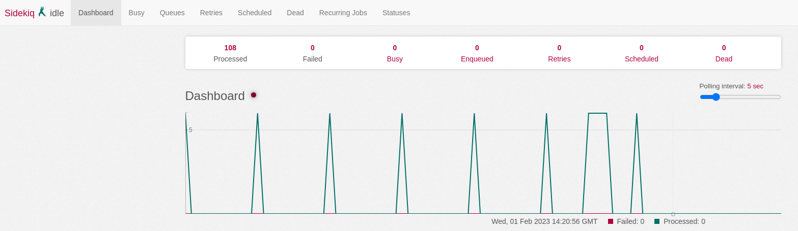

# Dockerizando SaudeSimples

- Necessário ter o `docker` e `docker compose`
- Para instalação docker e docker compose acesse: [DOCKER](https://docs.docker.com/engine/install/ubuntu/), [POST-INSTALL](https://docs.docker.com/engine/install/linux-postinstall/), [DOCKER COMPOSE](https://docs.docker.com/compose/)
- `docker compose version # Docker Compose version v2.12.2` versão que foi relaizado a primeira configuração

## Files

- Clone o projeto saudesimples
- Na `root` run `git clone https://github.com/OM30/saudesimples`

- Copie e cole na raiz do projeto a chave pública e privada que tens acesso aos repositórios (NÂO COMMIT ELAS JAMAIS!!!)
- Gere suas ecdsa `ssh-keygen -t ecdsa -b 521 -C "your_email@example.com"`. Adicionei ao sua conta github a `.pub`
- Copie para raiz do `saudesimples-dockerizado`. Devem conter as seguintes nomenclaturas `id_ecdsa` e `id_ecdsa.pub`

## RUN in container

 - A depender da versão do `docker compose` rode `docker compose` or ` `docker-compose`
 - Run `docker compose build`

 

 - Run `docker compose run app_v2 bash`. Dentro do container siga os passos a seguir
 - Run `echo '{ "allow_root": true }' > /root/.bowerrc`
 - Run `rake bower:install`
 - Se aparecer as questões sobre Jquery escolha a opção `2`: `1.11.1`

 

## Data base

 - Ainda tem o gargalo de necessitar restaurar o dump do banco atual (Migrations with trouble)

 - Abaixo o exemplo de importação de uma dump `.gz`. Existem outras formas.

 - Com o dump do banco em mãos
 - Copie o dump para o container do postgres Exemplo: `docker cp saudesimples_development.sql.gz <ID_CONTAINER>:/tmp/`
 - Para obter o id do container rode docker ps
 - Depois de copiado

 - Run ` docker exec -it <ID_CONTAINER> bash`. Dentro do container siga os passos a seguir
 - Crie uma ROLE no postgres:
 - Acesse o psql `su - postgres`, `psql`: `CREATE ROLE om30 WITH SUPERUSER;`
 - Crie DATABASE:
 - Acesse o psql `su - postgres`, `psql`: `CREATE DATABASE saudesimples_development;`
 - Saia do PSQL
 - Import o banco: `gunzip -c /tmp/saudesimples_development.sql.gz | psql -U postgres saudesimples_development`

 - Crie o arquivo `saudesimples/config/database.yml` com o conteúdo a seguir:

```ruby
defaults: &defaults
  adapter: postgresql
  encoding: unicode
  host: <%= ENV.fetch("DB_DATABASE") { 'db' } %>
  username: <%= ENV.fetch("DB_USERNAME") { 'postgres' } %>
  password: <%= ENV.fetch("DB_PASSWORD") { 'postgres' } %>
  # https://guides.rubyonrails.org/configuring.html#database-pooling
  pool: <%= ENV.fetch("RAILS_MAX_THREADS") { 30 } %>

development:
  <<: *defaults
  database: saudesimples_development

test:
  <<: *defaults
  database: saudesimples_test

production:
  <<: *defaults
  database: saudesimples_production
```

 - ### Audits

 - É uma boa pratica gerar o dump sem a tabela de auditorias, pois fica bem menor e mais rápido o processamento.

 - É necessário criar a tabela de auditoria de forma separada, mesmo com o dump. Siga os procedimentos previstos [aqui](https://github.com/OM30/saudesimples/wiki/Criar-tabela-Audits)

 ```ruby
 ActiveRecord::Migration.create_table :audits, :force => true do |t|
  t.column :auditable_id, :bigint
  t.column :auditable_type, :string
  t.column :associated_id, :bigint
  t.column :associated_type, :string
  t.column :user_id, :bigint
  t.column :user_type, :string
  t.column :username, :string
  t.column :action, :string
  t.column :audited_changes, :text
  t.column :version, :bigint, :default => 0
  t.column :comment, :string
  t.column :remote_address, :string
  t.column :created_at, :datetime
end
ActiveRecord::Migration.add_index :audits, [:auditable_id, :auditable_type], :name => 'auditable_index'
ActiveRecord::Migration.add_index :audits, [:associated_id, :associated_type], :name => 'associated_index'
ActiveRecord::Migration.add_index :audits, [:user_id, :user_type], :name => 'user_index'
ActiveRecord::Migration.add_index :audits, :created_at
ActiveRecord::Migration.add_column :audits, :request_uuid, :string
ActiveRecord::Migration.add_index :audits, :request_uuid
 ```

 - Rode as última migrations: `bundle exec rake db:migrate`

## RUN APP

 - Rode os containers:
 - Run: `docker compose up`
 - ### Elastichsearch

 - `cp saudesimples/config/initializers/elasticsearch.rb.example saudesimples/config/initializers/elasticsearch.rb`
 - Altere `ENV['ELASTICSEARCH_URL'] = 'http://localhost:9200'` para: `ENV['ELASTICSEARCH_URL'] = 'http://elasticsearch_v2:9200'`
 - Para indexar as buscar no elasticsearch após a criação do banco rode a task `rake searchkick:reindex:all`

 ## Tela de acesso

 - Acesso `http://localhost:4000/` e verá como abaixo a tela de login:
 - Acesse `rails c` e altere a senha de produtos `Usuario.where(login: 'produtos').first.update_attribute(:password, 'admin')` ou de outro `Usuário` para ter acesso ao app

 

 ## Sidekiq

 Em: `Sidekiq.configure_client` e `Sidekiq.configure_server`
 - Configure o path para o redis em: `saudesimples/config/initializers/sidekiq.rb`
 - Subistitua: `config.redis = { namespace: 'saudesimples254', url: 'redis://127.0.0.1:6379/saudesimples254' }` por:
 `config.redis = { namespace: 'saudesimples254', url: 'redis://redis_v2:6379/saudesimples254' }`

 Acesse o container `app_v2`: `docker compose run app_v2 bash` e rode o seguinte comando:
  - `bundle exec sidekiq`
 Acesse: `http://localhost:4000/sidekiq/` e verá a seguinte tela:

 


## PRY

 Para utilizar o `pry` em outro terminal rode `docker attach <ID | NAME_APP>`

 Ex.:
  - `docker attach 0d1ef78b3dc7`
  - `docker attach saudesimples-dockerizado-app-1`

 Também há outra opção que seria subir o container utilizando: `docker compose run --service-ports app_v2`

## Configuração de ambiente de teste (RSpec)

Para que os testes rodem, é necessário ter um banco de testes previamente populado, para isso rode os seguintes
comandos:

- Run ` docker exec -it <ID_CONTAINER> bash`. Dentro do container siga os passos a seguir
- Run `rake db:create db:migrate db:seed RAILS_ENV=test`
- Run rspec `bin/rspec`

## Compartilhando recurso com a V3

Para integração com a api v3 é necessário criar uma `network` nomeada de `saude_simples` e depois subir os containers a seguir `elastichserarch_v2` e o `db_v2` junto a `app_v2`:
- RUN `docker network create -d bridge saude_simples`
- Run `docker compose app_v2 elasticsearch_v2`

No `docker-compose.yml` a api da V3 deve ser adicionar em `app:` como segue

```yml
    networks:
      - saude_simples
    external_links:
      - app_v2:app_v2
      - elasticsearch_v2:elasticsearch_v2
      - db_v2:db_v2
```

## TODO

- Add Jasper way
- Comando para obter IP do jasperserver: docker inspect <ID_JASPER_DOCKER_SERVER> | grep "IPAddress"

```yml
  jasperserver:
    image: ghcr.io/om30/jasperserver:7.1.0
    restart: always
    ports:
      - '8080:8080'
      - '8443:8443'
    environment:
      WEB_APP_NAME_CE: jasperserver
      DB_TYPE: postgresql
      DB_PORT: 5432
      DB_HOST: db
      DB_USER: postgres
      DB_PASSWORD: postgres

volumes:
  ...
  jasperserver_data:
```
