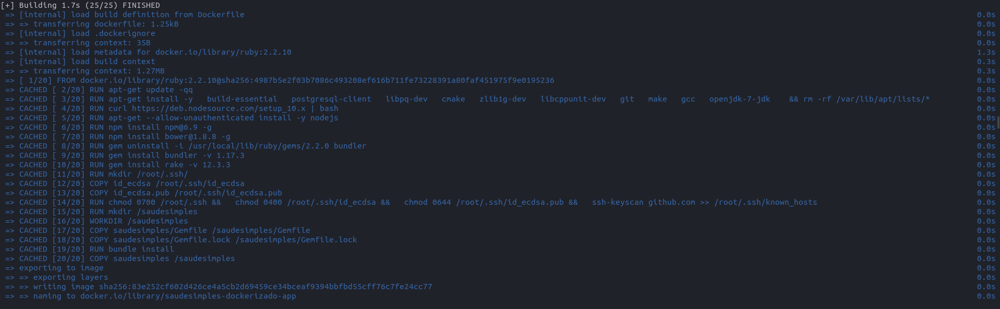
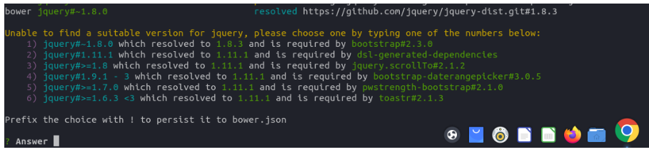
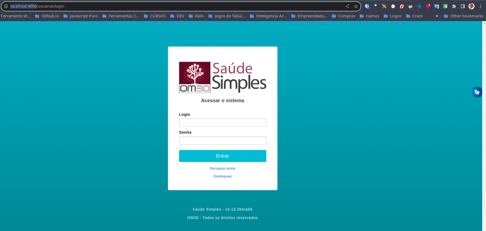

# Dockerizando SaudeSimples

- Necessário ter o `docker` e `docker compose`
- Para instalação docker e docker compose acesse: [DOCKER](https://docs.docker.com/engine/install/ubuntu/), [POST-INSTALL](https://docs.docker.com/engine/install/linux-postinstall/), [DOCKER COMPOSE](https://docs.docker.com/compose/)
- `docker compose version # Docker Compose version v2.12.2` versão que foi relaizado a primeira configuração

## Files

- Cone o projeto saudesimples
- Na `root` run `https://github.com/OM30/saudesimples`

- Copie e cole na raiz do projeto a chave pública e privada que tens acesso aos repositórios (NÂO COMMIT ELAS JAMAIS!!!)
- Renomei para `id_ecdsa` e `id_ecdsa.pub`

## RUN in container

 - A depender da versão do `docker compose` rode `docker compose` or ` `docker-compose`
 - Run `docker compose build`

 

 - Run `docker compose run app bash`. Dentro do container siga os passos a seguir
 - Run `echo '{ "allow_root": true }' > /root/.bowerrc`
 - Run `rake bower:install`
 - Se aparecer as questões sobre Jquery escolha a opção `1`: `1.8.0`

 

## Data base

 - Ainda tem o gargalo de necessitar restaurar o dump do banco atual (Migrations with trouble)

 - Abaixo o exemplo de importação de uma dump `.gz`. Existem outras formas.

 - Com o dump do banco em mãos
 - Copie o dump para o container do postgres Exemplo: `docker cp saudesimples_development.sql.gz <ID_CONTAINER>:/tmp/`
 - Para obter o id do container rode docker ps
 - Depois de copiado

 - Run ` docker exec -it <ID_CONTAINER> bash`. Dentro do container siga os passos a seguir
 - Crie uma ROLE no postgres:
 - Acesse o psql `su - postgres`, `psql`: `CREATE ROLE om30 WITH SUPERUSER;`
 - Crie DATABASE:
 - Acesse o psql `su - postgres`, `psql`: `CREATE DATABASE saudesimples_development;`
 - Saia do PSQL
 - Import o banco: `gunzip -c /tmp/saudesimples_development.sql.gz | psql -U postgres saudesimples_development`

 - ### Audits

 - É uma boa pratica gerar o dump sem a tabela de auditorias, pois fica bem menor e mais rápido o processamento.

 - É necessário criar a tabela de auditoria de forma separada, mesmo com o dump. Siga os procedimentos previstos [aqui](https://github.com/OM30/saudesimples/wiki/Criar-tabela-Audits)

 - Rode as última migrations: `bundle exec rake db:migrate`

## RUN APP

 - Rode os containers:
 - Run: `docker compose up`
 - ### Elastichsearch

 - Para indexar as buscar no elasticsearch após a criação do banco Acesse `rails c` e rode `rake searchkick:reindex:all`

 ## Tela de acesso

 - Acesso `http://localhost:4000/` e verá como abaixo a tela de login:
 - Acesse `rails c` e altere a senha de produtos `Usuario.where(login: 'produtos').first.update_attribute(:password, 'admin')` ou de outro `Usuário` para ter acesso ao app

 
